***
# <h1 align="center"> 💥Desafíos del curso Lógica de programación: explorar funciones y listas💥 </h1>
***

<p align="center">
<br>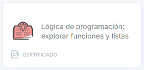
</p>

## 📄Descripción del proyecto

```sh

El curso "Lógica de programación: explorar funciones y listas" es la continuación del primer 
curso de Lógica de programación: "sumérgete en la programación con JavaScript". En este nuevo 
módulo, el objetivo principal es profesionalizar aún más el proyecto del juego del número 
secreto desarrollado en el curso anterior.

```

## 📃Objetivos de aprendizaje

```sh

1. Integración con HTML:

 - El estudiante será capaz de integrar su lógica de programación con elementos HTML para crear 
   una interfaz de usuario más amigable y accesible.
 - El estudiante podrá utilizar HTML para mejorar la presentación y la interactividad del proyecto 
   del juego del número secreto.

2. Dominio de funciones:

 - El estudiante comprenderá el concepto y la importancia de las funciones en la programación.
 - El estudiante será capaz de crear, invocar y organizar su código utilizando funciones de manera 
   efectiva.
 - El estudiante aplicará el uso de funciones para mejorar la estructura y la modularidad de su 
   proyecto.

3. Manejo de listas o arreglos:

 - El estudiante explorará y comprenderá el uso de listas o arreglos, una estructura de datos 
   fundamental en programación.
 - El estudiante podrá almacenar, manipular y procesar múltiples valores utilizando listas o 
   arreglos.
 - El estudiante aplicará el uso de listas o arreglos para mejorar la funcionalidad y la eficiencia 
   de su proyecto.

4. Profesionalización del proyecto:

 - El estudiante logrará profesionalizar aún más el proyecto del juego del número secreto 
   desarrollado en el curso anterior.
 - El estudiante aplicará los conceptos y herramientas aprendidos para mejorar la calidad, la 
   usabilidad y la escalabilidad de su proyecto.
 - Estos objetivos de aprendizaje están diseñados para que los estudiantes puedan continuar 
   desarrollando sus habilidades en programación y aplicarlas de manera práctica en el mejoramiento 
   de su proyecto.

```

## 🛠️Recursos y herramientas utilizados

```sh

- Trello: para organizar las tareas y el progreso del proyecto.
- Discord: para comunicarse con los compañeros y aclarar dudas.
- Cursos y formaciones de Alura Latam: para consultar contenidos relevantes y obtener más información.
- GitHub: para publicar y compartir el código del proyecto.
- LinkedIn: para conectarse con la comunidad y mostrar el aprendizaje adquirido.

```

## 📑Características

- Integrar su lógica de programación con elementos HTML, con el fin de crear una interfaz más amigable  
  y accesible para el usuario final.

- Profundizar en el uso de funciones, incluyendo su creación, invocación y cómo pueden ayudar a organizar   
  mejor el código.

- Explorar el uso de listas o arreglos, una estructura de datos fundamental en programación que permite   
  almacenar y manipular múltiples valores.

## 🌀Tecnologías Utilizadas

✔️HTML: se emplea este lenguaje de marcado para crear la estructura y la interfaz gráfica del juego   
  del número secreto que se desarrolla a lo largo del curso.

✔️CSS

✔️JavaScript: este lenguaje de se utiliza para agregar la lógica y funcionalidad al juego   
  del número secreto, utilizando funciones, listas/arreglos, y buenas prácticas de programación.  

## 🔆Resultados del Desafío 1

>> 

>> 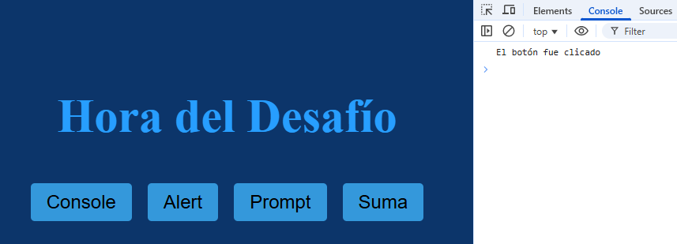

>> 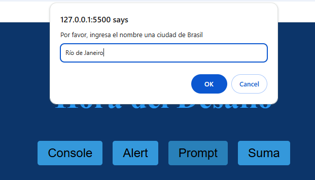

>> 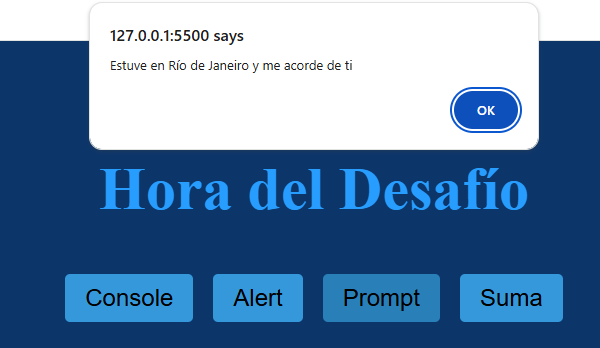

>> 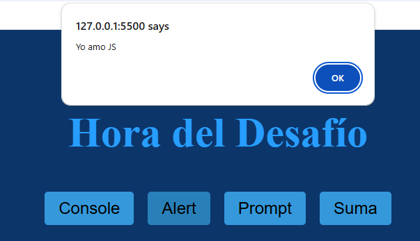

>> 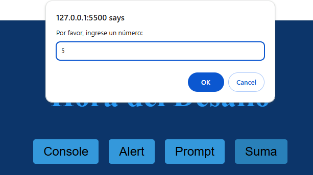

>> 

>> 

## 🔆Resultados del Desafío 2

>> 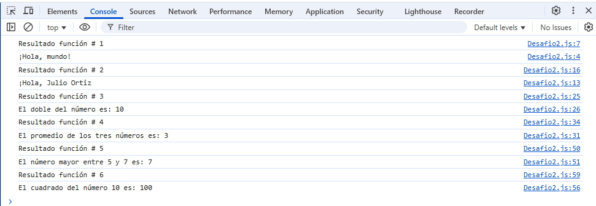

## 🔆Resultados del Desafío 3

>> 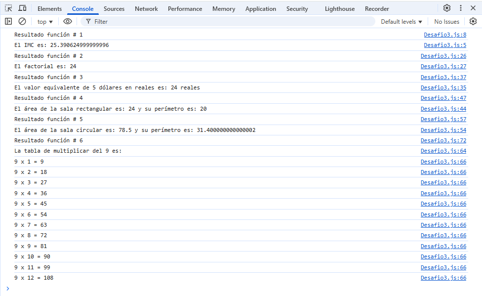

## 🔆Resultados del Desafío 4

>> 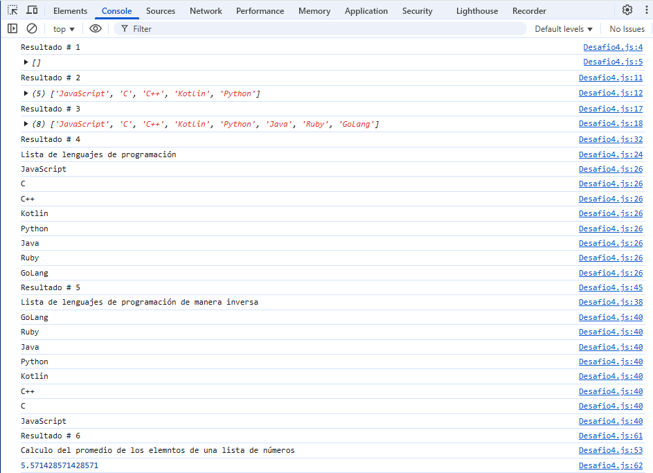

>> 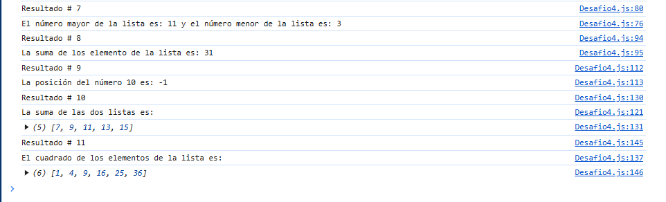

## 👩👨Autores del Proyecto

>>     Programación JavaScript y HTML
>                               
>>>   Programación HTML y CSS

## 📜Certificado

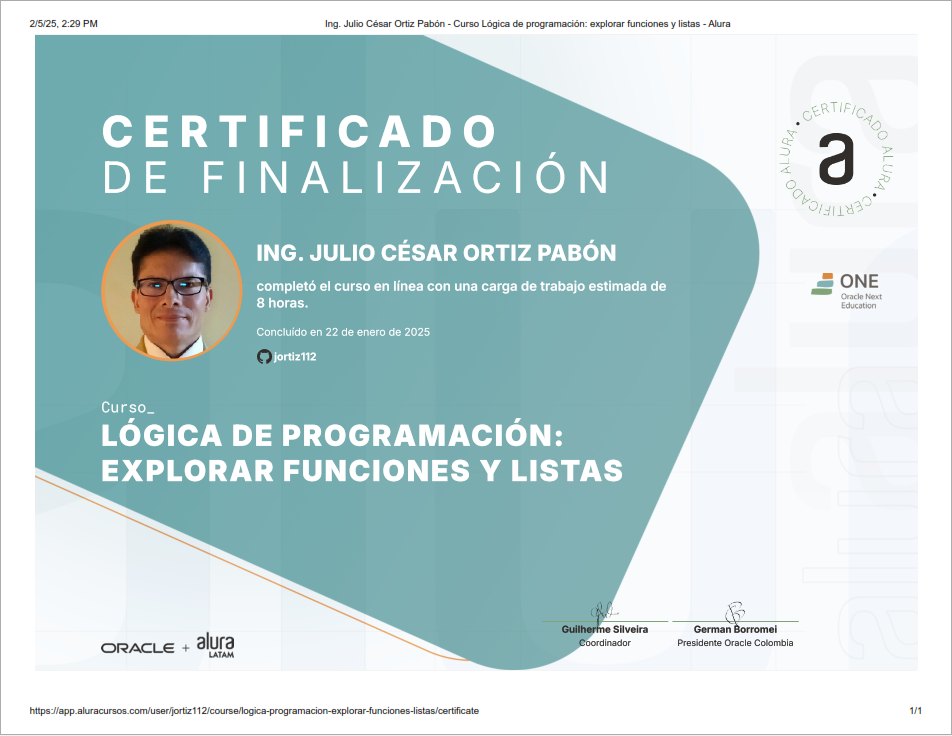


